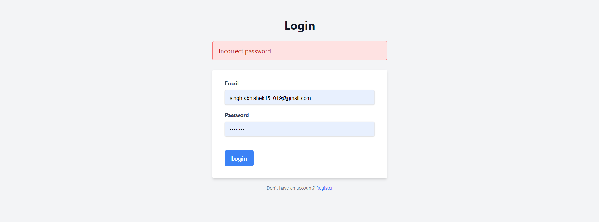
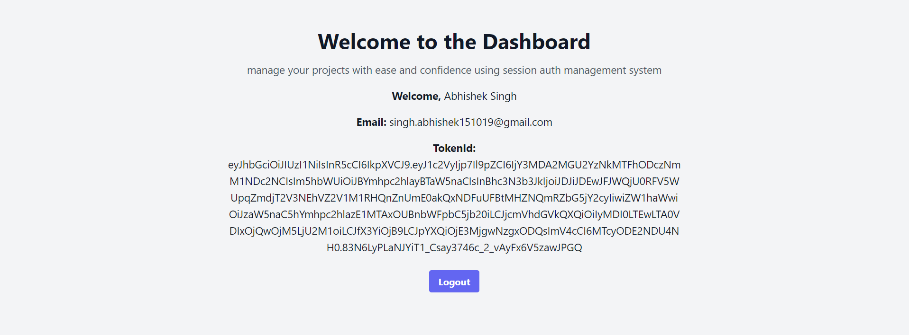

# Token Authentication Management

## Project Overview

This project is a token-based authentication system that provides login, registration, and logout functionality using **JWT (JSON Web Tokens)** with **Express**, **EJS**, **MongoDB**, and **cookie-parser**. The system manages user authentication using JWT tokens stored in cookies.

## Features

1. **User Registration**:
   - Allows new users to register by creating a username and password.
   - Passwords are securely hashed using **bcrypt** before storage.

2. **User Login**:
   - Registered users can log in with their credentials.
   - On successful login, a JWT is created and stored in cookies for subsequent requests.

3. **Token-based Authentication**:
   - JWTs are used for authenticating users. Each request verifies the JWT token sent in cookies.

4. **User Logout**:
   - Users can log out, which clears the JWT token from the cookies.

5. **Protected Routes**:
   - Access to certain routes is restricted and requires a valid JWT token.

## Previews





## Tech Stack

- **Node.js** & **Express**: For building the server and handling routing.
- **EJS**: For server-side rendering and templating.
- **MongoDB**: For storing user credentials.
- **Mongoose**: For interacting with the MongoDB database.
- **bcrypt**: For hashing user passwords before storing them.
- **cookie-parser**: For managing cookies that store JWT tokens.
- **jsonwebtoken**: For creating and verifying JSON Web Tokens (JWT).

## Installation

1. Clone the repository:

   ```bash
   git clone https://github.com/your-username/token-auth-management.git
   cd token-auth-management
   ```

2. Install dependencies:

   ```bash
   npm install
   ```

3. Create a `.env` file for your MongoDB connection string and JWT secret:

   ```bash
   MONGO_URI=mongodb://localhost:27017/token-auth-system
   JWT_SECRET=your_secret_key
   ```

4. Start the server:

   ```bash
   npm start
   ```

## Endpoints

- **GET /auth/login**: Displays the login form.
- **POST /auth/login**: Handles user login and returns a JWT token in cookies.
- **GET /auth/register**: Displays the registration form.
- **POST /auth/register**: Handles user registration and stores hashed passwords.
- **GET /auth/logout**: Logs out the user by clearing the JWT token from cookies.

## Project Structure

```folder
├── controllers
│   └── authController.js     # Handles login, registration, logout logic, and JWT management
├── models
│   └── userModel.js          # Mongoose schema and model for users
├── routes
│   └── authRoutes.js         # Routes for authentication (login, register, logout)
├── views
│   ├── layouts
│   │   └── main.ejs          # Layout for all EJS pages
│   ├── pages
│   │   ├── home.ejs          # Home page
│   │   ├── login.ejs         # Login page
│   │   └── register.ejs      # Register page
├── .env                      # Environment variables (e.g., MongoDB URI, JWT secret key)
├── app.js                    # Main Express application file
└── package.json              # Project metadata and dependencies
```

## Dependencies

- **bcrypt**: `^5.1.1`
- **cookie-parser**: `^1.4.6`
- **ejs**: `^3.1.10`
- **express**: `^4.21.0`
- **express-ejs-layouts**: `^2.5.1`
- **jsonwebtoken**: `^9.0.0`
- **mongoose**: `^8.7.0`

## Usage

1. **Register** a new user by visiting `/auth/register`.
2. **Login** using the credentials created during registration at `/auth/login`.
3. Once logged in, the JWT token is stored in cookies and can be used to access protected routes.
4. **Logout** by visiting `/auth/logout`.

## License

This project is licensed under the MIT License.
